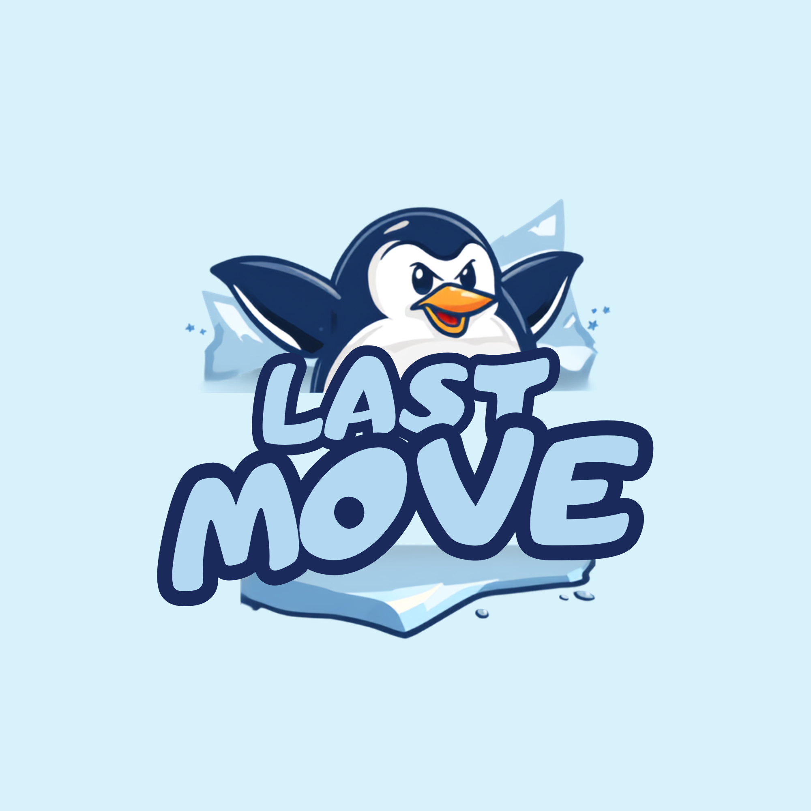

# Last Move

## Game Description

Last Move is a grid-based browser game where the player needs to reach the goal before the number of moves runs out.

The game has three levels, and each level becomes more challenging.

- Level 1: Frozen Shore
- Level 2: Christmas Village
- Level 3: Midnight Cabins

The player needs to avoid blocked spaces and hidden traps while trying to reach the goal.

## User Stories

- As a user, I want to see the game instructions so I know how to play.
- As a user, I want to see how many moves I have left.
- As a user, I want to use direction buttons to move around the grid.
- As a user, I want to use the keyboard arrows to control the player.
- As a user, I want to reach the goal before my moves run out.
- As a user, I want to see a message when I win or lose.
- As a user, I want to restart the game and try again.

## How to Play

1. Press **Start Game** to begin Level 1.
2. Use the direction buttons or keyboard arrow keys to move.
3. Keep track of the number of moves you have left.
4. Avoid blocked spaces and hidden traps.
5. Reach the goal before your moves run out.
6. Complete all three levels to finish the game.

## Levels

### Level 1 - Frozen Shore

The player moves through the frozen grid and needs to avoid blocked spaces while reaching the safe zone.

### Level 2 - Christmas Village

This level introduces hidden random traps. Some snow spaces contain the Grinch, and landing on one causes the player to lose.

### Level 3 - Midnight Cabins

The player needs to reach the real cabin. Fake cabins are placed randomly, and choosing a fake cabin causes the player to fall into a hidden hole.

## Technologies Used

- HTML
- CSS
- JavaScript
- Git
- GitHub
- GitHub Pages

## Getting Started

Play the deployed game here:

[Last Move Game](https://mrymhussain.github.io/last-move-game/)

Use the direction buttons or keyboard arrow keys to move around the board.

Try to reach the goal before your moves run out.

## Planning Materials

The user stories and level planning used to build the project can be viewed in the sections above.

## Attributions

- Emojis were used for the game characters and board elements.
- A Grinch GIF is used in Level 2.

## Next Steps

Some features I would like to add in the future:

- More levels
- Different board sizes
- More themes
- More types of traps
- Sound effects
- A score system